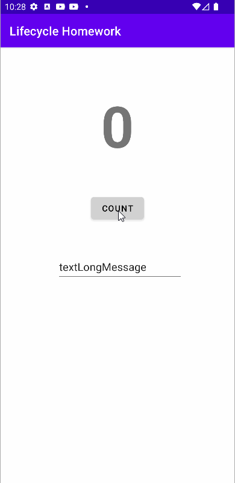
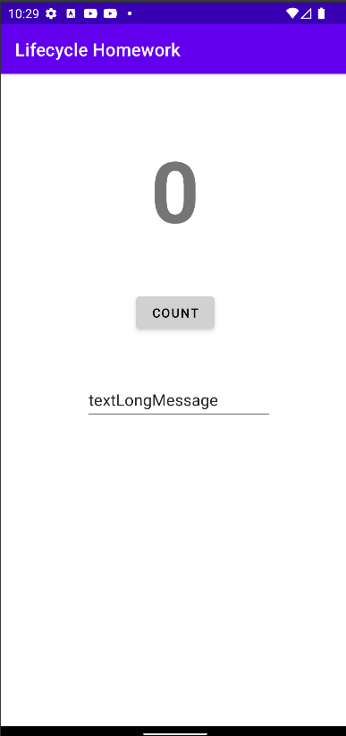
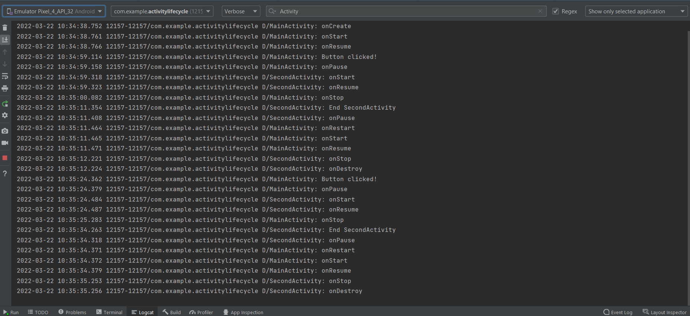

# Activity-lifecycle-and-state
tasks challenges homework

Activity lifecycle 

 
Lifecycle Homework 

 

 
layout challenge 

 
Logcat Activity of lifecycle 

<b>Question 1</b> 

If you run the homework app before implementing onSaveInstanceState(), what happens if you rotate the device? 

-> The counter is reset to 0, but the contents of the EditText is preserved.

<b>Question 2</b> 

What Activity lifecycle methods are called when a device-configuration change (such as rotation) occurs? 

-> Android shuts down your Activity by calling onPause(), onStop(), and onDestroy(), and then starts it over again, calling onCreate(), onStart(), and onResume().

<b>Question 3</b> 

When in the Activity lifecycle is onSaveInstanceState() called? 

-> onSaveInstanceState() is called before the onStop() method.

<b>Question 4</b> 

Which Activity lifecycle methods are best to use for saving data before the Activity is finished or destroyed? 

-> onPause() or onStop()

